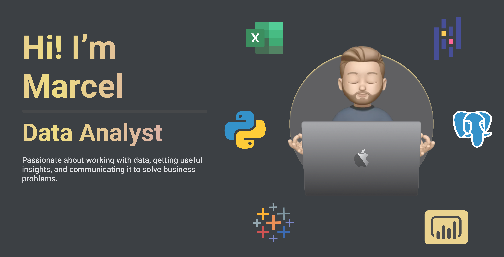

  

# 🦌 Marcel Buck

**Data Analyst | Python • SQL • Excel • Power BI • Machine Learning**

Master’s Degree in Information Systems (Wirtschaftsinformatik)  

Combining business understanding with data analytics.

📍 Germany  
📊 Data • BI • Predictive Analytics

---

# About Me

I help companies understand their data and turn it into actionable insights.

Before moving deeper into data analytics, I gained experience in **Business Development as a Working Student**, where I worked closely with business teams, market analysis and growth strategies.

This experience helps me connect **data insights with real business impact.**

• Build dashboards used by decision-makers  
• Analyze datasets to uncover trends and opportunities  
• Develop machine learning models to predict outcomes  
• Communicate insights clearly to technical and non-technical stakeholders  

Currently focusing on **advanced analytics and data engineering fundamentals.**

---

# Proof of Work

• Built churn prediction model with **ROC-AUC 0.87**  
• Reduced manual reporting by **60%** through dashboard automation  
• Identified **18% underperforming sales region** with data analysis  
• Work daily with **Python, SQL and BI tools** to solve business problems  

---

# Featured Projects

## Sales Performance Dashboard

**Problem**  
The company had no clear overview of regional sales performance.

**Solution**  
Developed an interactive Power BI dashboard combining SQL and Excel data sources.

**Impact**

• Identified **18% underperforming region**  
• Reduced reporting time by **60%**  
• Enabled faster decision-making for leadership

**Tech**

Power BI • SQL • Excel

**Project**

Repository | Dashboard

---

# Customer Churn Prediction

**Goal**  
Predict which customers are likely to cancel their subscription.

**Approach**

• Data cleaning and preprocessing in Python  
• Exploratory data analysis  
• Classification model using Scikit-Learn

**Results**

ROC-AUC: **0.87**

**Key Insights**

• Low engagement users far more likely to churn  
• Pricing tier strongly correlates with cancellations

**Tech**

Python • Pandas • Scikit-Learn • PostgreSQL

**Project**

Repository

---

# Tech Stack

### Data & Machine Learning

### Databases

### Data Visualization

### Tools

---

# Background

### Business Development – Working Student

- Automated lead research workflow  
- Supported sales and growth initiatives  
- Worked closely with stakeholders and data  

### Requirements Engineering – Intern

- Collected and structured business requirements  
- Created documentation for product teams  
- Translated business needs into technical tasks

---

# GitHub Stats

---

# Currently Learning

• Advanced SQL for analytics  
• Data engineering fundamentals  
• Production machine learning workflows  

---

# Open To

Data Analyst  
Business Intelligence Analyst  
Junior Data Scientist  

Remote • Germany • EU

---

# 🤝 Connect With Me

